# B1-3 노코드 자동화 기초: 워크플로우 설계  
## [프로젝트1] 자동화 도구 비교 구현
 ### 1. 도구별 워크플로우 구성 화면
+ **Zapier**  

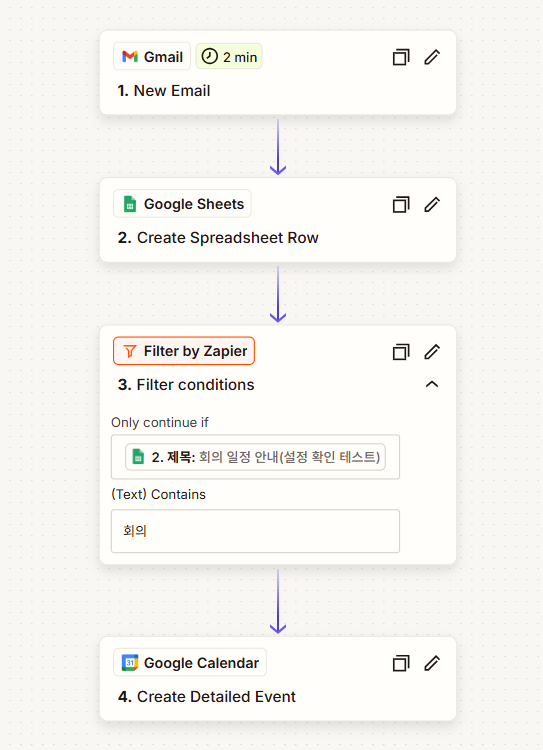  

  
+ **Make**

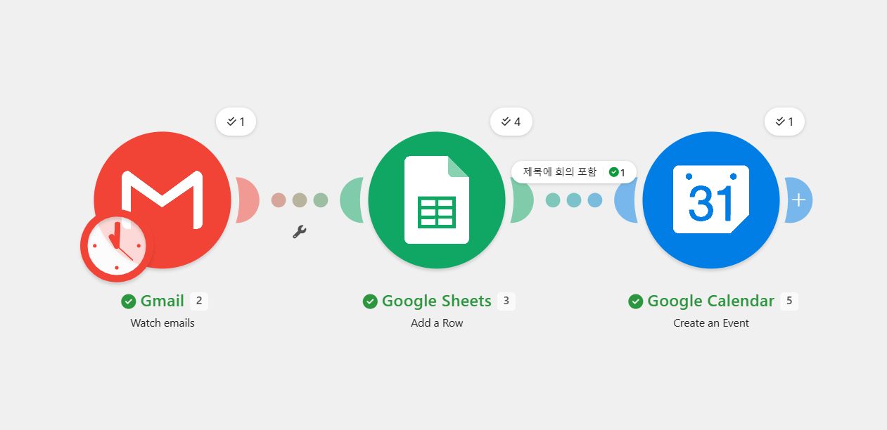  

******  

### 2. 실행 결과 화면  
+ **Zapier**

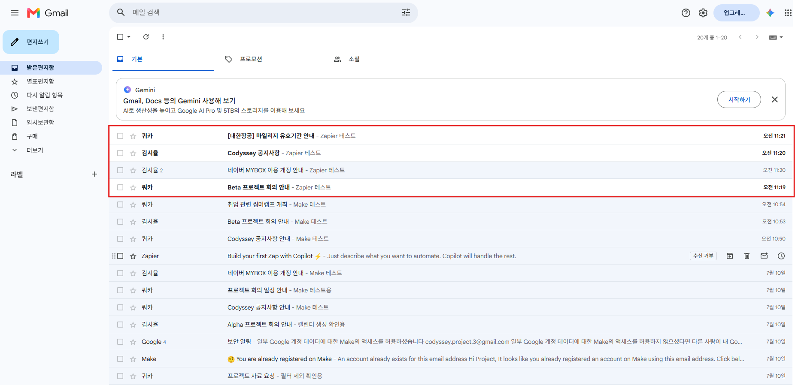  
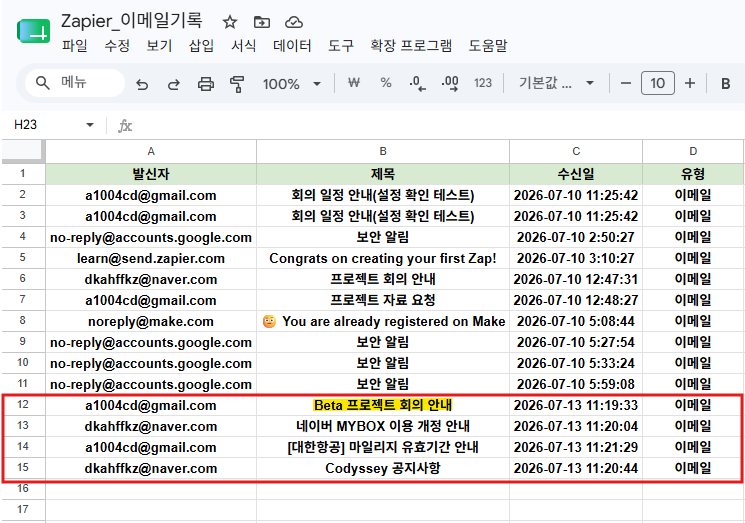  
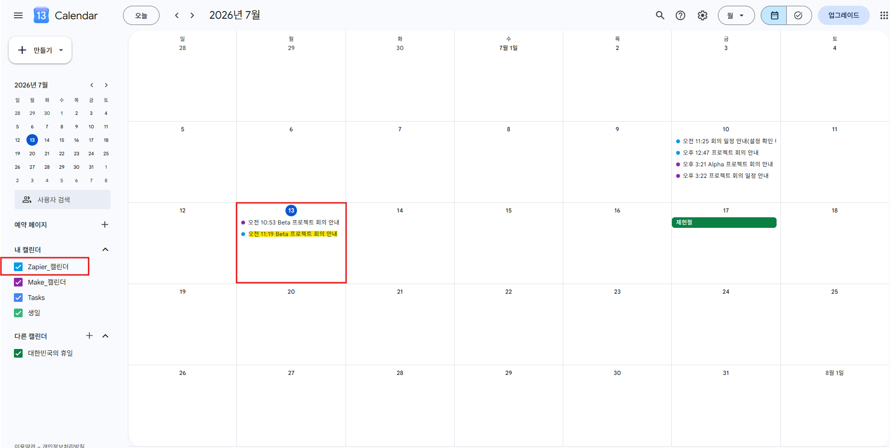  

+ **Make**

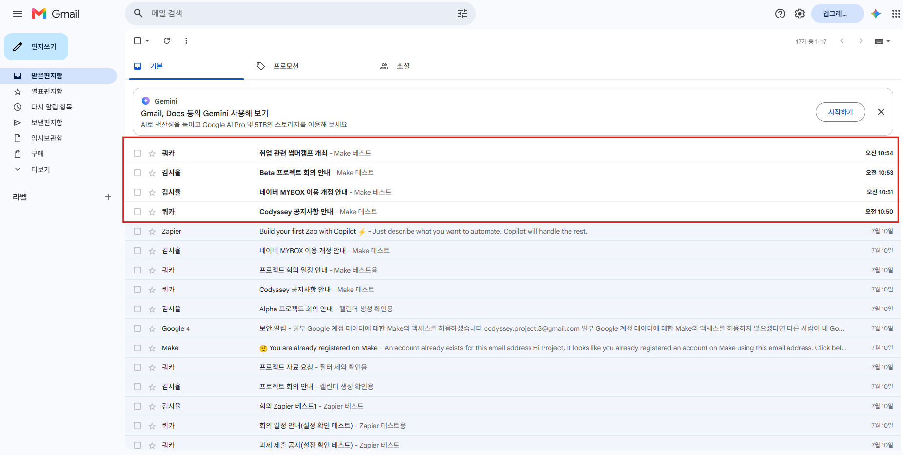  
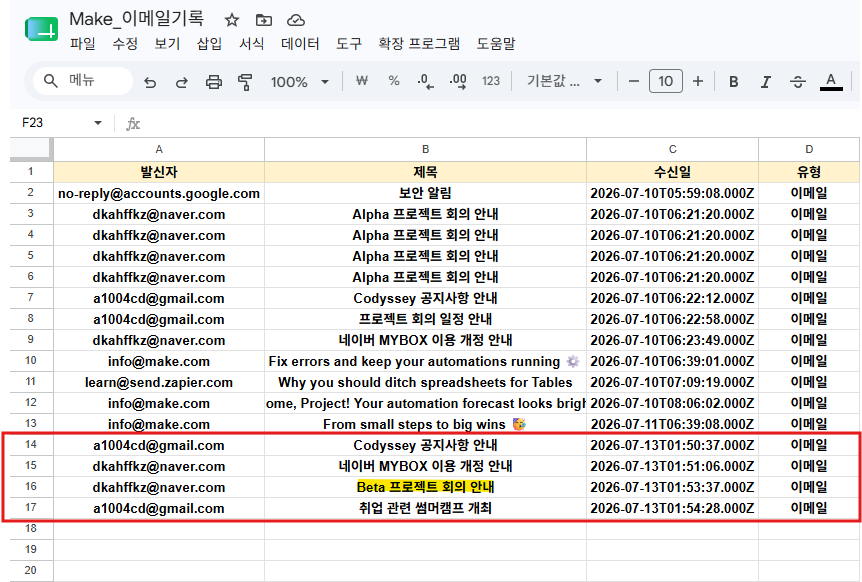  
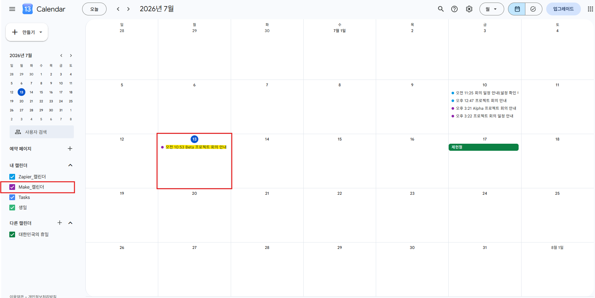  

  
******  
  

### 3. Zapier vs Make 비교 분석 보고서  
+ **사용 도구**
  
| Zapier | Make |
|------|------|
| -Trigger: Gmail (New Email) | -Trigger: Gmail (New Email) |
| -Action1: Google Sheets (Create Spreadsheet Row) | -Action1: Google Sheets (Add a Row) |
| -Filter: Contains "회의" | -Filter: Contains "회의" |
| -Action2: Google Calendar (Create Detailed Event) | -Action2: Google Calendar (Create an event) |  

  
+ **구현 과정 요약**
  
  \- Zapier: 각 모듈별로 테스트가 가능해 단계별 확인이 용이, 직관적인 UI와 순서대로 구성된 UX 덕분에 빠르게 구현 가능
  
  \- Make: 시나리오 셋팅 완료 후 테스트 가능, UI는 깔끔하지만 UX 구조가 복잡해 초보자에게는 난이도가 있음, 오류 발생 시 위치를 바로 표시해줘 수정 용이  

  
+ **비교 항목**
  
| 항목 | Zapier | Make |
|:---:|:---:|:---:|
| UI/UX | 리스트 기반 인터페이스. 단계별로 구성되어 직관적 | 시각적 노드 기반 인터페이스. 전체 흐름을 한 눈에 볼 수 있으나 초보자에게는 복잡하게 느껴질 수 있음 |
| 설정 난이도 | 직관적이고 학습 곡선이 낮음. 빠른 구현 가능 | 구조 이해가 필요하지만 익숙해지면 강력한 기능 제공 |
| 연동 서비스 범위 | 7,000+ 앱 지원 프리미엄 앱은 유료 플랜 필요 | 3,000+ 앱 지원 세부 커넥터 차이가 있으며 고급 기능은 학습 필요 |
| 무료 플랜 범위 | 월 100 Tasks | 월 1,000 Ops |
| 실행 로그 확인 방식 | 단계별 테스트 가능 오류 발생 시 `Task Failed` 형태로 표시됨 실패한 단계만 확인 가능하며 원인 파악은 로그를 열어봐야 함 | 전체 셋팅 후 테스트 가능 오류 발생 모듈이 시각적으로 표시됨 어디서 오류가 났는지 직관적으로 알 수 있음 |  

  
+ **장단점**

  \[Zapier]  
    
   \- 장점: 직관적 UI/UX, 단계별 테스트 가능, 다양한 앱 연동 지원  
   \- 단점: 무료 플랜 작업 수 제한, 다단계 불가(2단계까지만 가능), 일부 고급 기능 앱(ex:ChatGPT) 유료  

  \[Make]  
    
   \- 장점: 시각적 워크플로우 구성에 적합, 다단계 시나리오 가능, 오류 위치 표시로 수정 용이  
   \- 단점: 초기 학습 곡선이 있음, 무료 플랜의 데이터·로그·사용량 제한이 있음  

   
+ **적합한 상황**

  \-Zapier: 초보자가 빠르게 자동화를 구현하거나, 비교적 단순한 워크플로우를 쉽게 구성·관리하는 경우  
  \-Make: 여러 단계를 포함한 복잡한 시나리오를 설계해야 하거나, 실행 흐름과 오류 위치를 세부적으로 확인하며 관리해야 하는 경우  

  
---  

  
## [프로젝트2] 자유 주제 자동화 설계 및 구현  
 ### 1. 자동화 설계  
   
- **반복 업무 정의:**
  Google Calendar에 '회의' 일정이 등록되면 일정 정보를 Google Sheets에 저장하고, AI가 미리 입력된 프롬프트를 바탕으로 회의 준비 문서를 작성한 뒤 Google Docs에 자동으로 문서를 생성
  
- **선정 도구:** Make (다단계 시나리오 가능, 생성형 AI를 제외한 기본 모듈 무료 범위 내 구현 가능)  
  
- **워크플로우 흐름:**  
1. Trigger: Google Calendar - Watch Events (일정 등록)  
2. Filter: Contains '회의' ('회의'가 들어간 일정이 등록된 경우에만 다음 단계로)  
3. Action1: Google Sheets - Create Spreadsheet Row (일정제목/시작시간/종료시간/참석자/설명)  
4. AI Action: OpenAI(ChatGPT 5) - Generate Text (회의 준비 문서 작성)  
5. Action2: Google Docs - Create a Document (자동 문서 생성)
  
  
### 2. 구현 화면  

  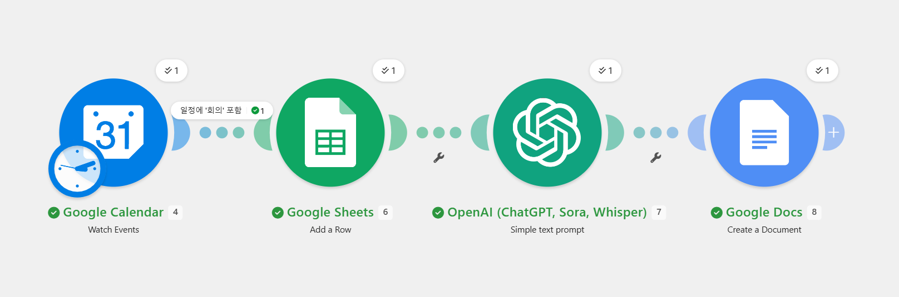  
  

### 3. 실행 결과 화면  

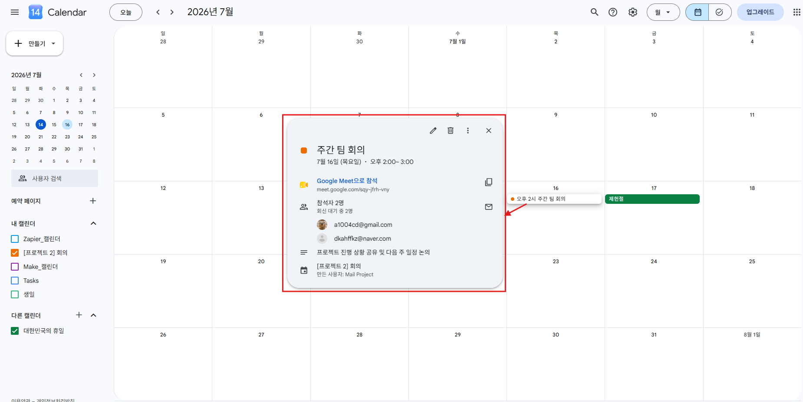  
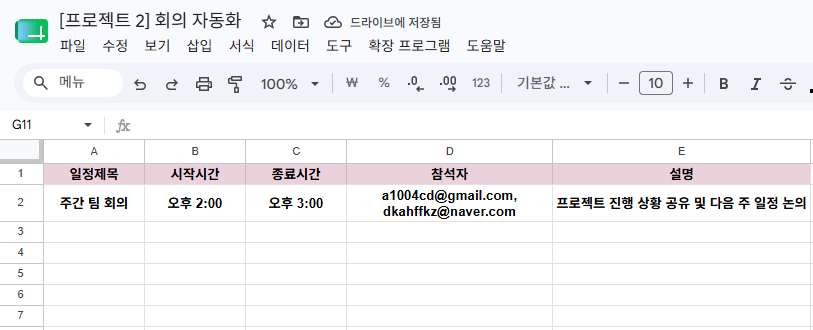  
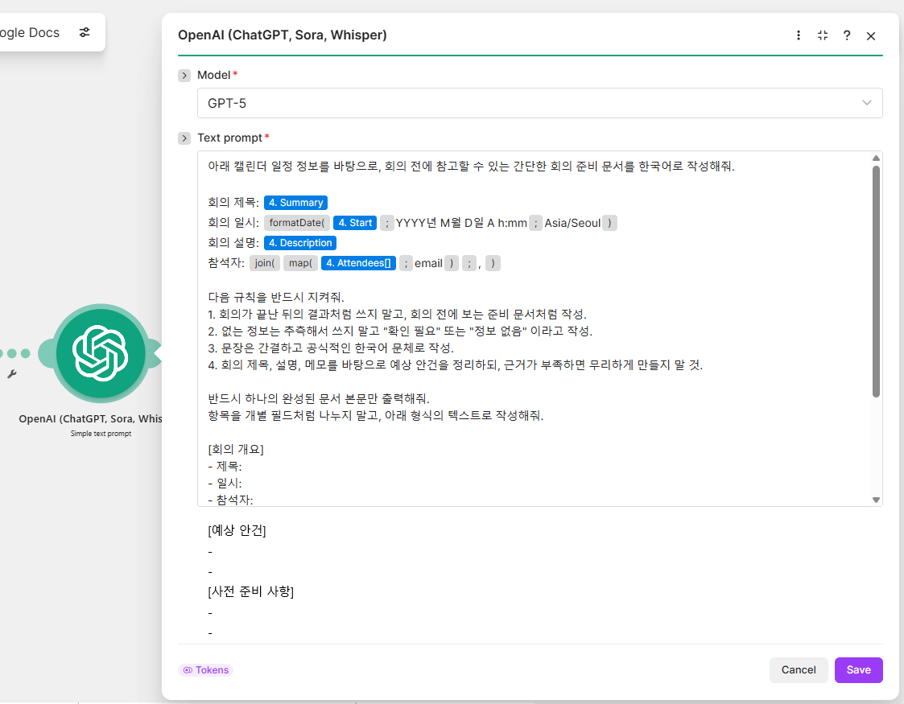  
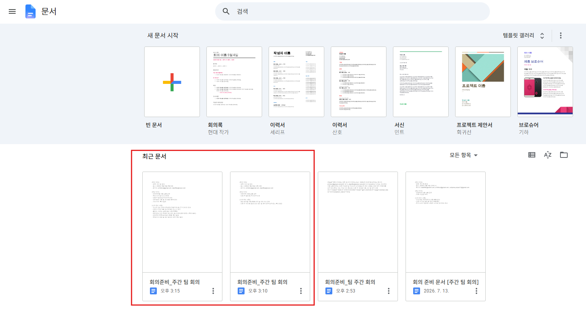  
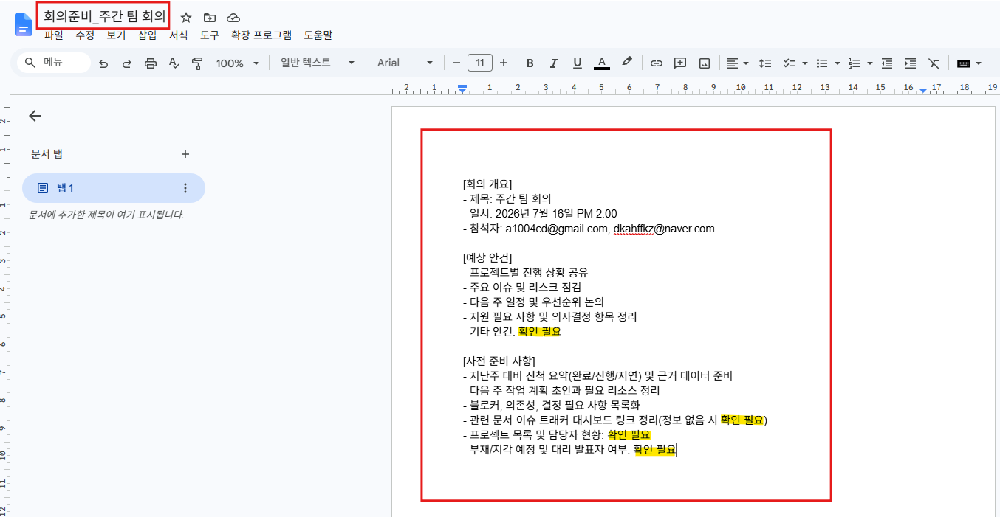  

### 4. 과금 리스크 완화 가이드  

- **유료 기능 사용:**
이번 자동화에서 **Make, Google Calendar, Google sheets, Google Docs는 무료 범위 내에 사용** 가능. 다만 회의 정보를 바탕으로 자연스러운 회의 준비 문서를 자동 작성하는 기능은 단순 템플릿 치환만으로는 한계가 있어, **AI 텍스트 생성 기능(OpenAI API)를 사용.** 회의가 끝난 뒤 결과가 아니라 **회의 전 참고용 문서**를 작성해야 했고, 없는 정보는 추측하지 않도록 제어해야 했기 때문에 문맥을 해석하고 조건에 맞게 문장을 구성할 수 있는 생성형 AI 사용이 불가피함.
  
- **무료 대안**
  - 템플릿 기반 문서 생성: AI를 제거하고, Google Docs 또는 Google Sheets에 고정된 템플릿 문서를 자동 생성하는 방식. 예를 들어 회의 제목, 시간, 참석자, 설명만 삽입하고 안건·준비 사항은 미리 정한 문구를 사용.  
  - 장점: 완전 무료 구현 가능, 구조가 단순하고 안정적  
  - 단점: 문서 내용이 항상 정형적, 맞춤형 안건을 생성하지 못함, 회의별 품질 차별화가 어려움  

 - **무료 대안 구현 화면**

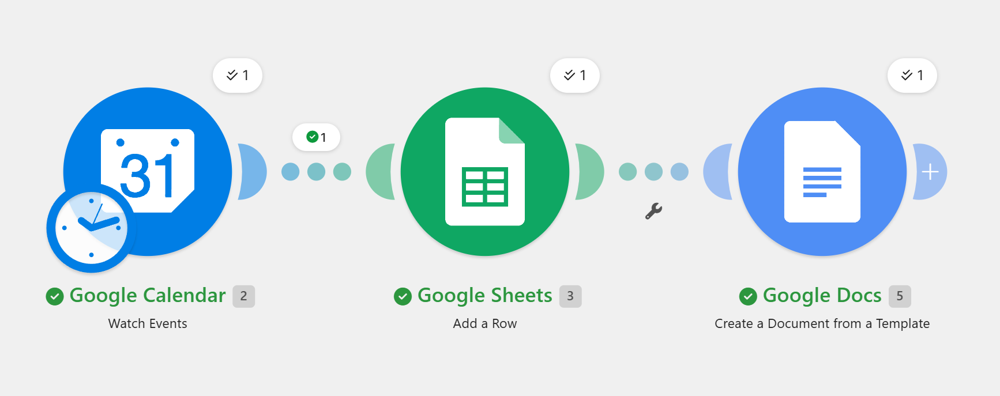  
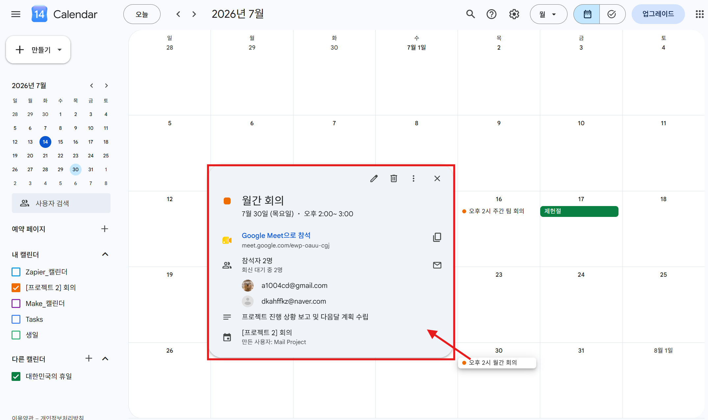  
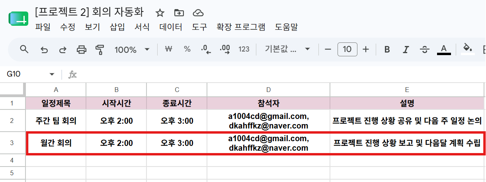  
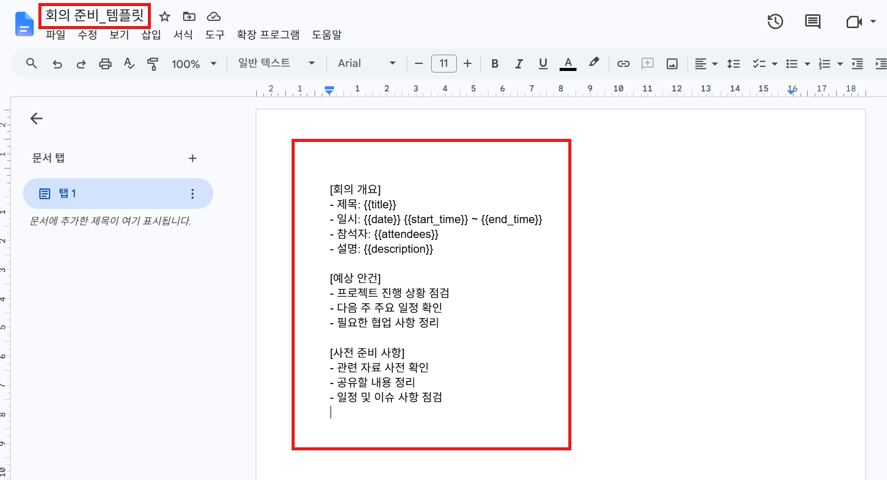  
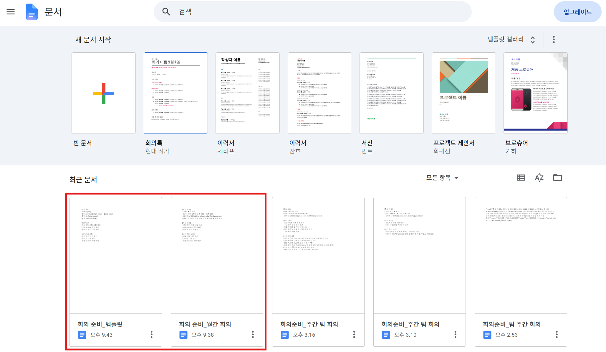  
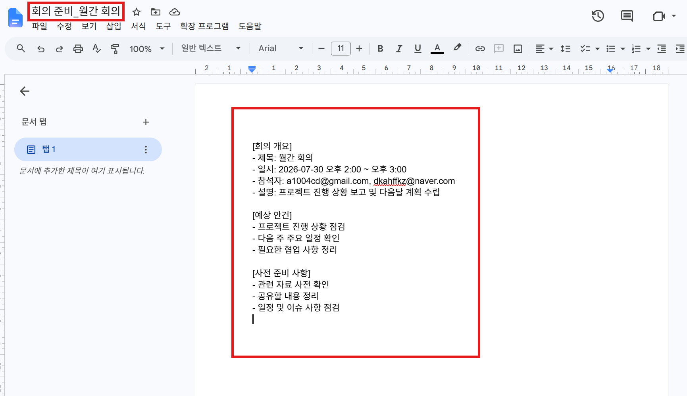  

### 5. 보너스 과제  
 - **AI 연동 Action 추가:**  
 워크플로우에 생성형 AI(ex:ChatGPT, Claude 등)를 Action으로 추가해 텍스트(요약/분류/템플릿 메시지)를 자동 생성  

 
---  

